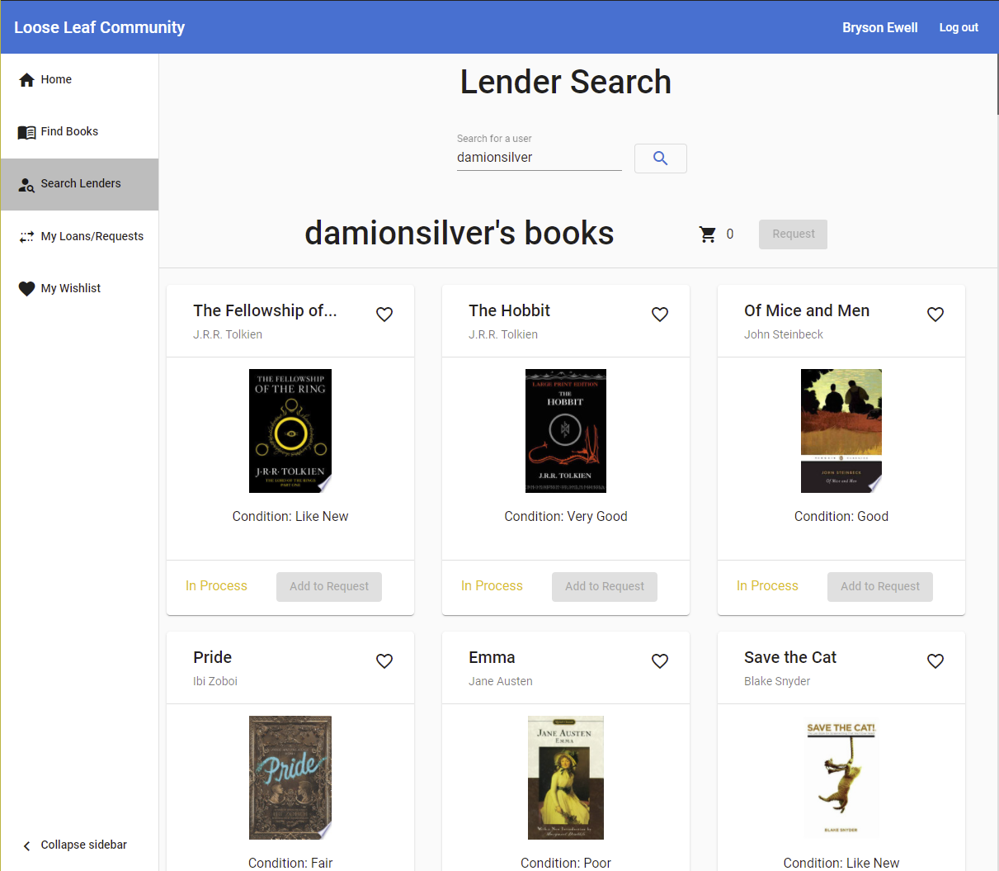

# Loose Leaf Community

## Project Description

Loose Leaf Community is a .NET web application where users can borrow and loan books to others in their community. Users can check-in and check-out books, add books to their bookshelf to loan out, and add books to their wishlist that they would like to borrow. Loose Leaf Community utilizes the Google Books API to find information about a book by its ISBN.

## Technologies Used

* C#
* ADO.NET Entity Framework
* HTML
* JavaScript
* CSS
* Angular
* TypeScript
* Microsoft Azure
* SQL Server

## Features

List of features ready and TODOs for future development
* Request books to borrow from other users
* Loan books out to other users
* Search for a book by title, author, or genre
* Make a wishlist of books to borrow in the future
* See books recommended for you based on your borrowing history

To-do list:
* Add addresses for book pickup and drop-off
* Clean up genres so that they match the given book

## Getting Started

> The program must use SQL server, other SQL variations may not work.

- Run the command `git clone https://github.com/2102-feb08-net/team1-p2-server` to clone the repository.
- Create a new SQL database in Azure
- In database settings, set the firewall settings to "Allow Azure services and resources to access this server"
- Create a new AppService in Azure
- In the App Service settings under Configuration, create a new connection string with Name being "LooseLeafDatabase" and the Value being the connection string to the database created earlier.
- Open `LooseLeafSQL.sql` in SQL Server 2019
- Run the script on the new database that was just made
- Open the Solution file in Visual Studio
- Finally, right-click on the Web project in Visual Studio and then select Publish to begin publishing the project.
- Follow the steps show to then publish the application to your Azure App Service.
- This then completes the set-up for the back-end. Now follow the set-up [here](https://github.com/2102-feb08-net/team1-p2-client) for setting up the front-end.
- Finally, open your web browser to http://localhost:4200/ to run the application.

## Usage

To use the program, first run the application by running `ng serve --open` to go to http://localhost:4200/.
You are then brought to a login page. You must then login or create an account.
Once authorized, you are brought to the main page. Here you will see recommended books, your loan history, and current wishlist.
You can also add books you by typing in an ISBN13 for the book you wish in the respective field.

You can search for books in the database, you can go to the "Find Books" tab and then search books based on title, author, or genre.

Now to request a book loan, go to the "Search Lenders" tab. This will bring you to a page that looks like this:

Here you can then type in the name of a user you wish to search for in the search bar at the top. Afterwards, a collection of books will appear on the screen. You can then add the "Available" books to your cart by pressing the green button or add them to your wishlist by clicking on the heart icon.

Once you have selected all of the books you want to request, you can then process the order by pressing the Request button at the top of the list. Finally, fill in your information and then submit the request.

You can then go to the "My Loans/Requests" to see any active or pending loans. If someone request a book from you, their order would be shown to you, which you can then accept or deny.

Finally, you can go to the "My Wishlist" page to see the books on your wishlist.

## Contributors

> Bryson Ewell, John Werner, Damion Silver, Ashley Brown

## License

This project uses the following license: [MIT License](https://mit-license.org/).
